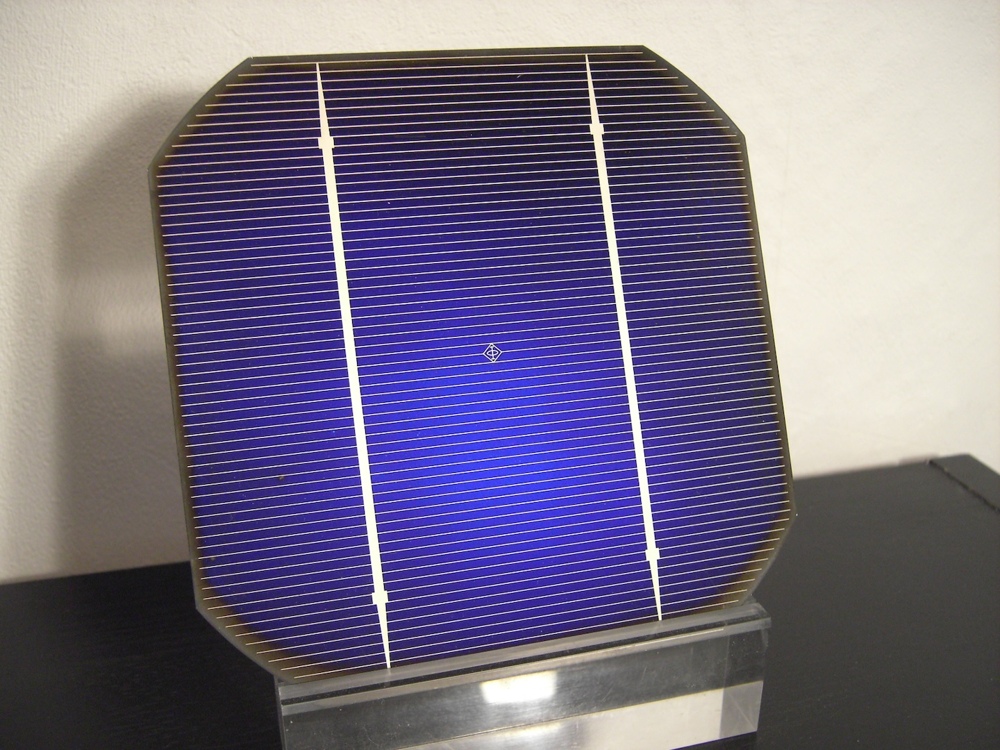
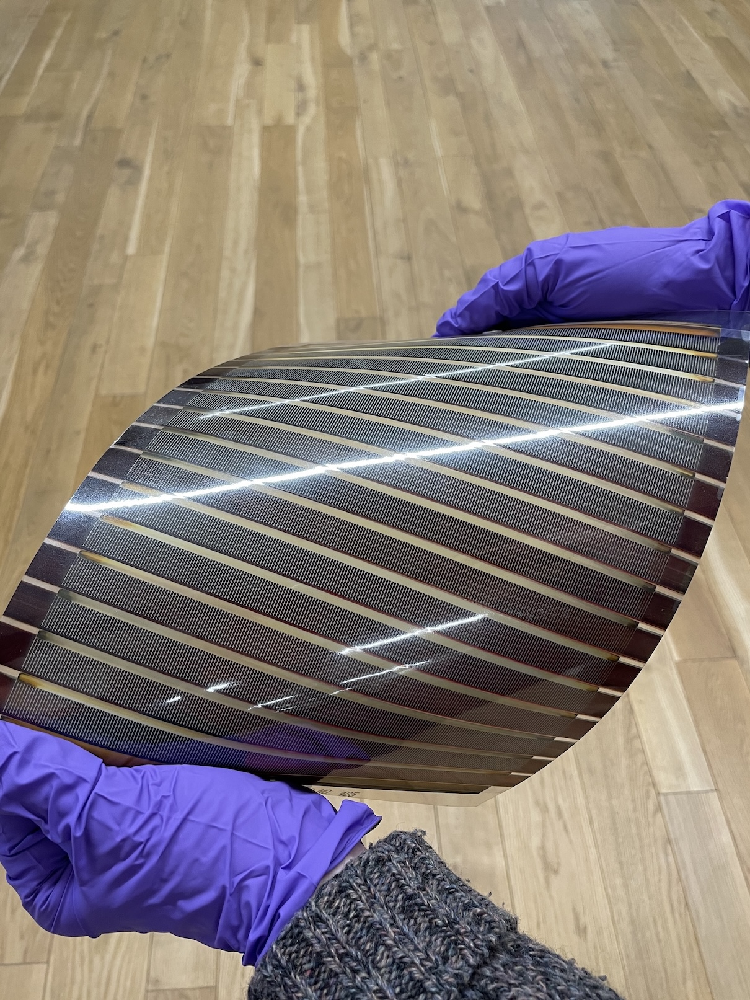
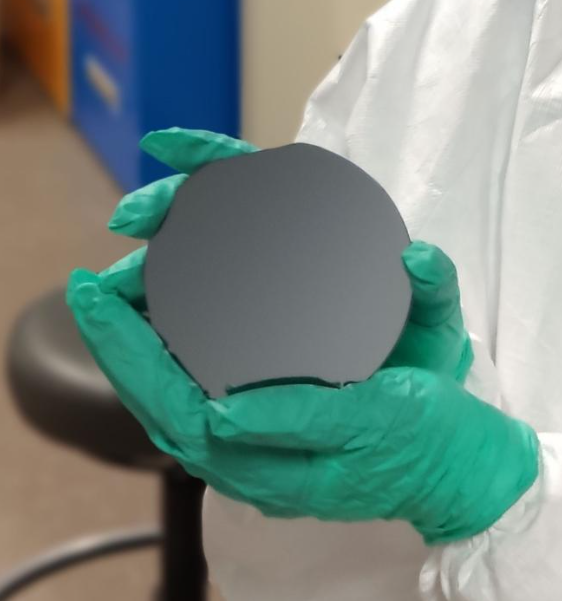
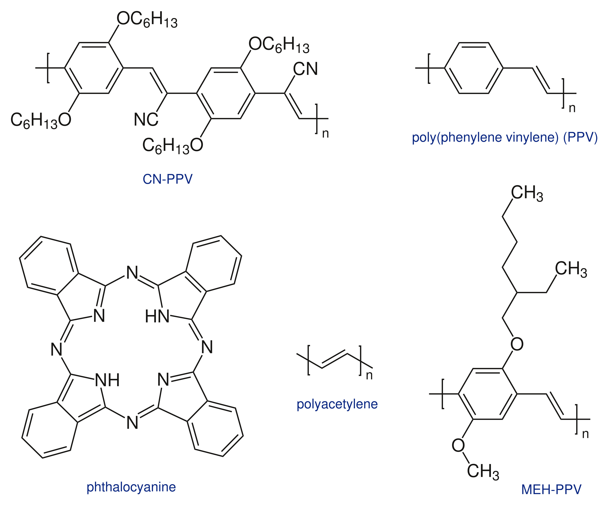
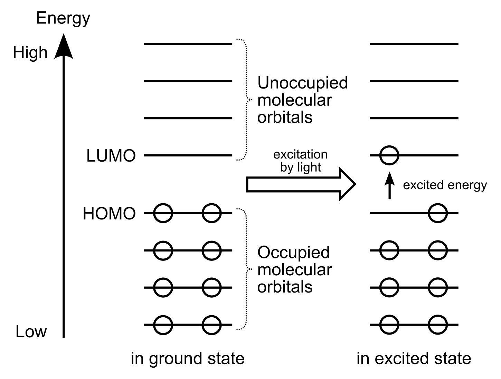

## The Big Picture: Our Energy Future & The Role of Solar

The world is in a race to find sustainable energy sources to combat climate change. Solar energy, which converts sunlight into electricity, is a cornerstone of this transition. You've likely seen traditional solar panels on rooftops; these are amazing technologies, but the quest for even better, cheaper, and more versatile solutions is relentless. This project places you at the forefront of that quest, using data science to unlock the potential of a new generation of solar technology.

Our client, OMEGALAB, is developing next-generation solar cells known as **Organic Photovoltaics (OPVs)**, a flexible, lightweight, and potentially low-cost alternative to traditional panels. They've asked you to predict key molecular properties based solely on chemical structure. Accurate predictions can significantly accelerate the discovery of new materials, replacing the slow and costly process of synthesizing and testing each candidate in the lab.

<div style="display: flex; gap: 1rem; justify-content: center;">
  
  
</div>
<figure style="text-align: center; margin-top: 0.5rem;">
  <figcaption><em>Figure 1: A silicon solar cell (left) and an organic solar cell (right). Left: "125x125-pseudo-square-monocrystalline-solar.cell" by Stephan Kambor, Wikimedia Commons, CC BY-SA 2.5. Right: "OPV slot-die" by FreudianCritz, Wikimedia Commons, CC BY-SA 4.0.</em></figcaption>
</figure>

## Silicon vs. OPVs

For decades, the solar market has been dominated by silicon-based solar cells. Silicon is a fantastic material for this job. It's a **semiconductor**, a special class of material that can be "tuned" to conduct electricity under certain conditions, which is the fundamental principle behind solar cells and all modern electronics. To understand a semiconductor, think of materials as having different abilities to let electrons (the carriers of electricity) flow:

- **Conductors** (like copper wire): Electrons flow freely.
- **Insulators** (like rubber): Electrons are tightly held and don't flow.
- **Semiconductors** (like silicon): These are in the middle. They are naturally insulators, but with a little energy (like from sunlight), we can excite their electrons, causing them to jump across an "energy gap" (called the **bandgap**) and start flowing as an electric current.

The name 'Silicon Valley' itself comes from the silicon used in computer chips. The global industry that grew from that valley relies on incredible precision to manufacture those chips. Companies like ASML, a global semiconductor leader located just 60 km from our campus, are at the heart of this industry. ASML builds the highly complex lithography machines that create the microscopic transistors and circuits on silicon wafers — the brains powering everything from your phone to advanced data centers.

<figure style="text-align: center;">
  
  <figcaption><em>Figure 2: A 4-inch silicon wafer used as a substrate in both photovoltaic cells and computer microchips. "4 inch float zone n-type silicon wafer with amorphous silicon thin film heterojunction structure" by Radiotrefoil, Wikimedia Commons, CC BY-SA 4.0.</em></figcaption>
</figure>

However, silicon has its drawbacks. The panels are rigid, heavy, and the manufacturing process is energy-intensive. This is where Organic Photovoltaics (OPVs) come in:

- **What does "Organic" mean here?** In chemistry, "organic" refers to molecules primarily built from carbon atoms, often linked with hydrogen, oxygen, and nitrogen. These are the building blocks of plastics, polymers, and life itself.
- **OPVs** use these specialized organic molecules to absorb light and generate electricity.
- **The Promise of OPVs:** They can be lightweight, flexible, semi-transparent, and potentially manufactured at a low cost using printing-like techniques. Imagine solar-collecting windows or jackets.
- **The Challenge:** Currently, OPVs are less efficient and less durable than silicon. Typical silicon panels can reach efficiencies of 20–23%, while commercial OPVs are often in the 10–15% range, and they can degrade more quickly when exposed to the elements. Our project aims to close this gap.

<figure style="text-align: center;">
  
  <figcaption><em>Figure 3: Examples of organic photovoltaic molecules. "Examples of organic photovoltaic materials" by Leyo, Wikimedia Commons. Public domain.</em></figcaption>
</figure>

## The "Business" Need: Finding Better Molecules, Faster

The core of an OPV is the organic molecule that captures light. Its effectiveness depends on specific electronic properties and its durability. The key properties we are interested in for this project are HOMO, LUMO, and stability. **HOMO and LUMO tell us how easily the molecule can move electrons; stability tells us how long it survives.**

- **HOMO (Highest Occupied Molecular Orbital) & LUMO (Lowest Unoccupied Molecular Orbital):** You can think of these as the energy levels of the molecule's electrons. The difference between the HOMO and LUMO levels is effectively the molecule's bandgap. The absolute energy levels of HOMO and LUMO are critical for how efficiently the generated electrons can be extracted from the solar cell.
- **Stability:** Stability is related to the duration for which the molecule, and consequently the solar cell, remains intact before it breaks down and stops working effectively. A fantastic molecule that dies after a few days is useless for a real-world product that needs to last for years.

The right combination of HOMO, LUMO, and high stability is the "holy grail" for a new OPV material. Finding it means creating a more efficient and commercially viable product.

<figure style="text-align: center;">
  
  <figcaption><em>Figure 4: Diagram of HOMO and LUMO molecular orbitals, demonstrating how an electron can move from HOMO to LUMO upon excitation by light. "Molecule HOMO-LUMO diagram" by Tomgally and Parutakupiu, Wikimedia Commons. Public domain.</em></figcaption>
</figure>

## The Old Way vs. The Data Science Way

How do chemists currently find these properties?

1. **Synthesize the Molecule:** A chemist spends days or weeks in a lab creating a tiny amount of a new, proposed molecule.
2. **Measure Properties:** There are multiple experimental measurement techniques to measure the HOMO and LUMO levels (e.g., Cyclic Voltammetry).
3. **Test Stability:** A solar cell is fabricated using the molecule and then exposed to sunlight, heat, and humidity for hundreds or even thousands of hours, while its performance is monitored at multiple time points. If the device retains most of its initial efficiency over time, the molecule is considered stable; if performance drops significantly, it is classified as unstable.

This process is incredibly slow and expensive. You can maybe test a few dozen molecules a year this way. But there are millions upon millions of *possible* molecules that could be synthesized! **This is where you come in.** Machine learning offers a revolutionary alternative. Instead of making and testing every molecule, what if we could predict its properties just from its blueprint — its molecular structure?

## Machine Learning

To do this, we need a standardized way for our models to understand molecules. Consider the molecule phthalocyanine, whose molecular formula is C₃₂H₁₈N₈. This tells us how many atoms are present, but gives us no information about how they are connected, which is critical for understanding molecular properties. So how can we preserve not just the count of atoms, but also the structural information? We use a text-based representation called a **SMILES string**. The SMILES string for phthalocyanine is:

```
C1=CC=C2C(=C1)C3=NC4=NC(=NC5=C6C=CC=CC6=C(N5)N=C7C8=CC=CC=C8C(=N7)N=C2N3)C9=CC=CC=C94
```

**This looks complicated, but don't worry — you'll never have to write one yourself. You don't need to know how SMILES strings are created or how to read them.** The main point is that this string can be converted back into the two-dimensional structure of the molecule without loss of information. It captures both the atoms and their connections. What matters is that we will use these strings as input for our machine learning models to predict HOMO, LUMO, and stability.

Machine learning models work with numbers, but SMILES strings are text. So how do we convert them into numbers? We'll use [RDKit](https://www.rdkit.org), a powerful open-source cheminformatics library in Python, to parse SMILES strings and compute **molecular descriptors**. These descriptors are numerical features that capture the molecule's size, shape, and chemical properties. Your task is to build a model that takes these descriptors as input and predicts the HOMO, LUMO, and stability as output.

By building a reliable predictive model, we can computationally screen millions of virtual molecules in the time it takes a lab to test one. This allows OMEGALAB to focus their expensive lab work only on the most promising candidates identified by your model, accelerating the pace of material discovery by orders of magnitude. This is not just a course project — it's a direct path to making a significant impact on the future of renewable energy.
