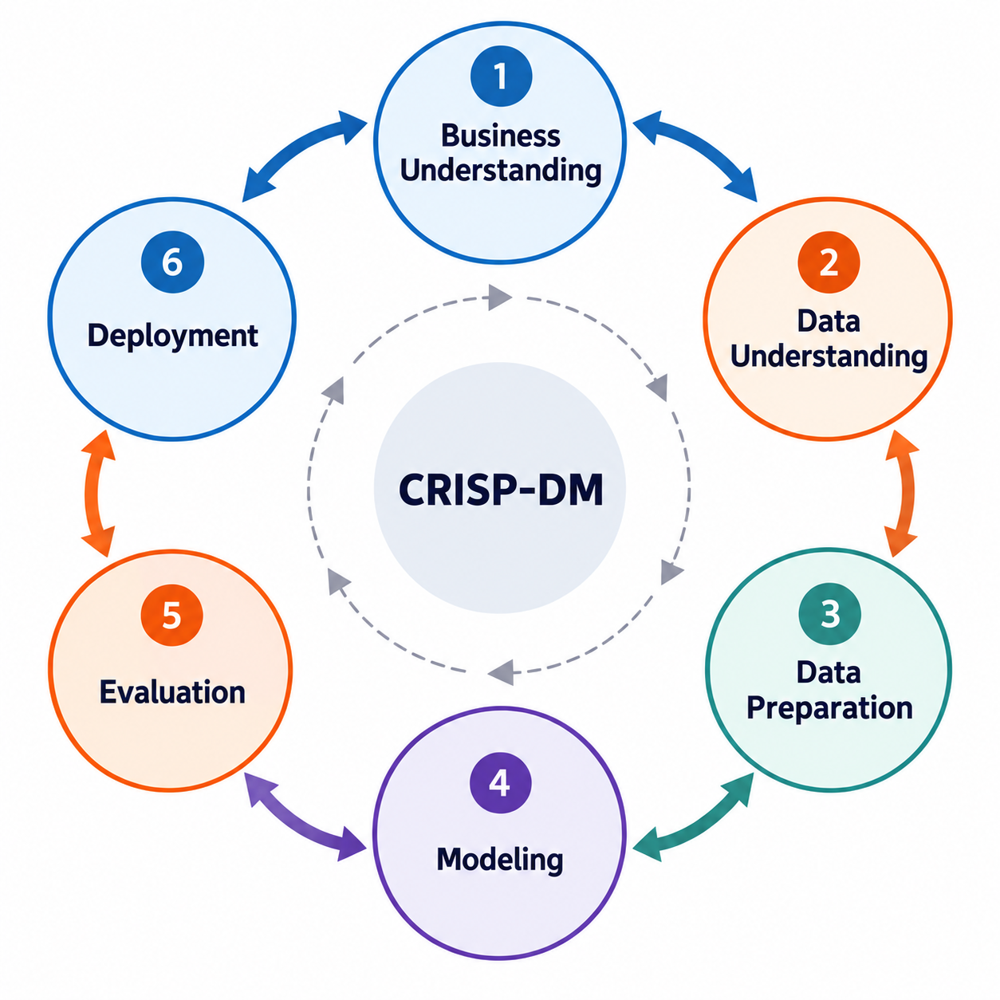

<style>
.quarto-title-block {
  display: none;
}
</style>

# Overview {.unnumbered .overview-title}

:::::::: {.ml-home}

:::::: {.ml-hero}

::::: {.ml-hero-copy}

:::: {.ml-brand}

{alt="Breda University of Applied Sciences logo"}


::: {.ml-program}
**Applied Data Science & AI**  
Year 1 · Machine Learning
:::

::::

::: {.ml-hero-title}
<span class="hero-line">Learn machine learning</span>
<span class="hero-line accent">by solving a real problem.</span>
:::

::: {.ml-lead}
The Omega Lab is searching for molecules for next-generation solar cells. Testing each one in the lab is slow and expensive. They want you to build a machine-learning model that predicts molecular properties, so they can screen thousands in seconds and only test the top candidates.
:::

::: {.ml-actions}
[Meet the client](#the-client){.ml-btn .ml-btn-primary}
[How the course works](#course-structure){.ml-btn .ml-btn-secondary}
:::

:::::

::::: {.ml-hero-image role="img" aria-label="Machine learning, molecular chemistry and flexible solar-cell research"}
:::::

::::::

:::::: {.ml-course-info-wrap}

::::: {.ml-course-info}

::: {.ml-course-info-item .lead}
<div class="ml-course-info-label">Instructor</div>
<div class="ml-course-info-value">M. Alican Noyan</div>
<div class="ml-course-info-meta">Machine Learning</div>
:::

::: {.ml-course-info-item}
<div class="ml-course-info-label">Program</div>
<div class="ml-course-info-value">Applied Data Science & AI</div>
<div class="ml-course-info-meta">Year 1 · 2026/27</div>
:::

::: {.ml-course-info-item}
<div class="ml-course-info-label">Institution</div>
<div class="ml-course-info-value">Breda University of Applied Sciences</div>
<div class="ml-course-info-meta">Breda, The Netherlands</div>
:::

::: {.ml-course-info-item}
<div class="ml-course-info-label">Project Client</div>
<div class="ml-course-info-value">Prof. Derya Baran · OMEGA Lab</div>
<div class="ml-course-info-meta">KAUST · Organic photovoltaics</div>
:::

:::::

::::::


:::::: {.ml-section .ml-client #the-client}

:::: {.ml-video}
```{=html}
<!-- Click-to-load: YouTube is only contacted after the visitor presses play. -->
<button type="button" class="ml-video-poster" data-video-id="2dMROtxPB3M" data-start="179"
        aria-label="Play video: Prof. Derya Baran on powering the future (loads from YouTube)">
  <span class="ml-video-lattice" aria-hidden="true"></span>
  <svg class="ml-video-molecule" viewBox="0 0 400 400" aria-hidden="true">
    <g class="bonds">
      <polygon points="252,170 252,230 200,260 148,230 148,170 200,140" />
      <polygon points="238,178 238,222 200,244 162,222 162,178 200,156" class="inner" />
      <line x1="252" y1="170" x2="304" y2="140" /><line x1="304" y1="140" x2="356" y2="170" />
      <line x1="304" y1="140" x2="304" y2="82" />
      <line x1="148" y1="230" x2="96" y2="260" /><line x1="96" y1="260" x2="96" y2="318" />
      <line x1="200" y1="140" x2="200" y2="82" /><line x1="252" y1="230" x2="296" y2="262" />
    </g>
    <g class="atoms">
      <circle cx="252" cy="170" r="7" /><circle cx="252" cy="230" r="7" /><circle cx="200" cy="260" r="7" />
      <circle cx="148" cy="230" r="7" /><circle cx="148" cy="170" r="7" /><circle cx="200" cy="140" r="7" />
      <circle cx="304" cy="140" r="7" /><circle cx="96" cy="260" r="7" />
      <circle cx="356" cy="170" r="10" class="o" /><circle cx="304" cy="82" r="9" class="n" />
      <circle cx="96" cy="318" r="9" class="o" /><circle cx="200" cy="82" r="10" class="s" />
      <circle cx="296" cy="262" r="6" class="h" />
    </g>
  </svg>
  <span class="ml-video-play" aria-hidden="true"></span>
  <span class="ml-video-text">
    <span class="ml-video-kicker">Meet the client</span>
    <span class="ml-video-title">Prof. Derya Baran on powering the&nbsp;future</span>
    <span class="ml-video-source">KAUST × National Geographic · <em>Chasing Answers</em></span>
  </span>
  <span class="ml-video-consent">Loads from YouTube on play</span>
</button>
<noscript><a class="ml-video-fallback" href="https://www.youtube.com/watch?v=2dMROtxPB3M&t=179s" target="_blank" rel="noopener">Watch the video on YouTube</a></noscript>
<script>
  document.querySelectorAll(".ml-video-poster").forEach(function (poster) {
    poster.addEventListener("click", function () {
      var iframe = document.createElement("iframe");
      iframe.src = "https://www.youtube-nocookie.com/embed/" + poster.dataset.videoId +
        "?start=" + poster.dataset.start + "&autoplay=1&rel=0";
      iframe.title = "Prof. Derya Baran on powering the future";
      iframe.allow = "accelerometer; autoplay; clipboard-write; encrypted-media; gyroscope; picture-in-picture; web-share";
      iframe.allowFullscreen = true;
      poster.replaceWith(iframe);
      iframe.focus();
    });
  });
</script>
```
::::

:::: {.ml-client-copy}

::: {.ml-eyebrow}
The client
:::

## OMEGA Lab

The course is built around a real client problem from the Organic/Hybrid Materials for Energy Applications (OMEGA) Lab, led by Prof. Derya Baran at KAUST.

OMEGA Lab is developing materials and methods for more sustainable electronic and energy devices. Their work includes solar cells, organic and printed electronics, energy-conversion materials, and manufacturing processes designed to use less energy and reduce environmental impact.

They need your help to use machine learning to identify and predict promising molecules for solar cell applications.

[Visit the OMEGA Lab](https://www.omegalabresearch.com/){target="_blank"} · [Prof. Derya Baran at KAUST](https://www.kaust.edu.sa/en/study/faculty/derya-baran){target="_blank"}

::::

::::::

:::::: {.ml-section}

:::: {.ml-section-head}

::: {.ml-eyebrow}
The challenge
:::

## Predict Solar Cell Material Properties

You will develop a machine learning solution to predict solar cell material properties from molecular structure alone. This will allow the client to screen thousands of molecules computationally, reducing the need to synthesize and measure each one experimentally and helping them focus their resources on the most promising candidates.

::::

::: {.ml-pipeline}

:::

::::: {.ml-model-grid}

::: {.ml-model-card}
<div class="tag">Regression</div>

### Predict energy levels

The energy levels of a material strongly influence how efficiently a solar cell can convert light into electricity. You will build regression models to predict these energy levels directly from molecular structure.
:::

::: {.ml-model-card}
<div class="tag">Classification</div>

### Predict stability

Organic materials can degrade over time, so high efficiency alone is not enough. The client needs materials that are both efficient and stable. You will build models to predict material stability and help identify molecules that perform well on both properties.
:::

::: {.ml-model-card}
<div class="tag">Clustering</div>

### Discover similarity

Use unsupervised learning to identify molecular groups, investigate similarity, and feed those insights back into predictive modelling.
:::

:::::

::::::

:::::: {.ml-section}

:::: {.ml-section-head}

::: {.ml-eyebrow}
The Framework
:::

## Machine learning is a process.

In this course, CRISP-DM structures both how you learn machine learning and how you apply it in the course project.

{width="75%"}

These are not six steps that you complete once in order. Machine learning is an **iterative** process. You may move back and forth between Data Understanding and Data Preparation, evaluation may reveal that a preprocessing decision needs to be revisited, and deployment may even show that the original problem was not defined in the right way.

Therefore, it is important not to treat these stages as tasks to complete once and never revisit. Instead, move through the cycle early, learn from each stage, and use those insights to improve the next iteration.

::: {.ml-note}
**Note:** CRISP-DM was developed before many modern production machine learning practices existed. In particular, deployment today can include serving models, monitoring, retraining, data and model pipelines, reproducibility, governance, and continuous evaluation.

More modern frameworks such as CRISP-ML(Q) extend these ideas for production machine learning systems. In this introductory course we keep the simpler CRISP-DM structure so that we can focus on the core machine learning process. Production ML and these more modern practices are covered in later courses.
:::

::::

::::::

:::::: {.ml-section #course-structure}

:::: {.ml-section-head}

::: {.ml-eyebrow}
The Structure
:::

## Learn. Apply. Demonstrate.

In our program, every course has three core components: **Self-study**, **DataLab**, and **Assessment**.
Self-study teaches the core concepts independently of the course project. DataLab is where you apply those concepts to a real client challenge. Just like in a real project, this work produces deliverables such as code, reports, and presentations. These deliverables then form the basis for assessment.

For this public course, we kept all three components, but adapted them for independent learning without supervision or formal grading. Some activities that are part of the on-campus course are therefore simplified or omitted. For example, our students normally prepare and deliver a presentation as part of the assessment, while the public course focuses on the Kaggle competition as the main way to evaluate your solution and compare your performance.

::::

::::: {.ml-tracks}

::: {.ml-track}
### 📘 Self-study

Learn the concepts independently of the project.

- Learn how classification works
- Build and evaluate a model on a simple dataset
- Practice the workflow before using it in the project
:::

::: {.ml-track}
### 🧪 DataLab Project

Apply what you learned to the real client challenge.

- Work with the molecular dataset
- Build a model to predict molecular stability
- Improve your solution through successive CRISP-DM iterations
:::

::: {.ml-track}
### 🏁 Assessment

Demonstrate how well your solution performs.

- Predict on unseen molecules
- Submit your solution to the Kaggle competition
- Use your Kaggle score to evaluate and improve your model
:::

:::::

::: {.ml-note}
**About the data:** The course uses real molecular structures and features. For a fair educational competition, course-specific target values are generated to follow realistic chemical distributions.
:::

::::::

:::::: {.ml-section}

:::: {.ml-section-head}

::: {.ml-eyebrow}
Why this course is different
:::

## Machine learning is more than modeling.

Many introductory machine-learning courses focus mainly on algorithms and model performance. However, there is a big difference between building a model with excellent accuracy and building an ML solution that actually helps a client. In this course, students experience the broader workflow: understanding the domain and the client problem, turning raw data into something useful, and improving a solution through repeated iteration.

::::

::::: {.ml-difference}

::: {.ml-diff-card}
<div class="num">1</div>

### Start with the client

Successful ML projects require more than ML knowledge. Students are not expected to become chemists, but they do need to spend time understanding the client problem. This also means looking beyond model metrics: Are we solving the right problem? What would make the model useful to the client? What information about a molecule should the model actually use, and how can we represent that information through meaningful features?
:::

::: {.ml-diff-card}
<div class="num">2</div>

### Work with raw data

Many courses start with datasets that are already clean and ready for modelling. Real projects rarely do.
Students work with raw molecular data and learn how to inspect, understand and transform it into features suitable for machine learning. Preparing the data is not just a step before modelling, it is a core machine-learning skill.
:::

::: {.ml-diff-card}
<div class="num">3</div>

### Iterate through CRISP-DM

Iteration is often limited in teaching exercises: train a few models, compare the results, and move on. Real ML projects are much more iterative. Students repeatedly revisit data preparation, features, models and evaluation as they learn more about the problem. Some student projects in this course have gone through more than 100 experiments before reaching their final solution.
:::

:::::

::::::

:::::: {.ml-section}

:::: {.ml-section-head}

::: {.ml-eyebrow}
Student voices
:::

## What students say.

Selected answers from first-year students to the course evaluation survey.

::::

::::: {.ml-quotes}

::: {.ml-quote .ml-quote-featured}
<div class="ml-quote-tag">On the client project</div>

> I really like the fact that we worked with a real-life project and got the experience of a real data scientist role.

<div class="ml-quote-by">Year 1 student · Applied Data Science & AI</div>
:::

::: {.ml-quote}
<div class="ml-quote-tag">On CRISP-DM</div>

> We have the opportunity to see the whole process of developing an ML model.

<div class="ml-quote-by">Year 1 student</div>
:::

::: {.ml-quote}
<div class="ml-quote-tag">On the Kaggle competition</div>

> Kaggle competition allows us to experiment ourselves with the best approach.

<div class="ml-quote-by">Year 1 student</div>
:::

::: {.ml-quote}
<div class="ml-quote-tag">On understanding the code</div>

> Kaggle competition was very entertaining and eye opening, I had to truly understand code to get it right, and just asking Claude wouldn't've cut it.

<div class="ml-quote-by">Year 1 student</div>
:::

:::::

::::::


:::::: {.ml-section}

:::: {.ml-section-head}

::: {.ml-eyebrow}
COURSE MATERIALS & SETUP
:::

## Everything you need to get started.

::::

::: {.ml-sub-eyebrow}
Textbook
:::

The course uses selected chapters from the following book alongside the self-study materials.

::: {.ml-textbook}
<div class="ml-textbook-label">Course Textbook</div>
<div class="ml-textbook-title"><em>Hands-On Machine Learning with Scikit-Learn, Keras &amp; TensorFlow</em></div>
<div class="ml-textbook-meta">Aurélien Géron &nbsp;·&nbsp; O'Reilly Media &nbsp;·&nbsp; 3rd edition &nbsp;·&nbsp; 2022</div>
:::

::: {.ml-sub-eyebrow}
Prerequisites
:::

::::: {.ml-prereq-grid}

::: {.ml-prereq-card}
### Python

Variables, data structures, control flow, functions, and basic object-oriented programming at the level of an introductory programming course.
:::

::: {.ml-prereq-card}
### NumPy

Array creation, indexing, slicing, broadcasting, and vectorised operations on multi-dimensional arrays.
:::

::: {.ml-prereq-card}
### Pandas

Series and DataFrame manipulation, reading data files, filtering, grouping, and basic data reshaping.
:::

::: {.ml-prereq-card}
### Matplotlib

Creating line plots, histograms, and scatter plots; customising figures for exploratory data analysis.
:::

:::::

::: {.ml-sub-eyebrow}
Course resources
:::

::::: {.ml-resource-grid}

::: {.ml-resource-card}
<div class="ml-resource-top">
<span class="ml-resource-logo"></span>
<a class="ml-status ml-status-live" href="https://github.com/BredaUniversityADSAI/ml-book" target="_blank" rel="noopener">View on GitHub →</a>
</div>

### Course repository

The course repository contains the setup instructions, code, and data used throughout the course. It also explains how to prepare your Python environment using uv.
:::

::: {.ml-resource-card}
<div class="ml-resource-top">
<span class="ml-resource-logo ml-resource-logo-wide"></span>
<span class="ml-status">Under preparation</span>
</div>

### Kaggle competition

The course includes a Kaggle competition where you generate predictions for unseen molecules and submit them for evaluation. Your leaderboard score gives you an indication of how well your solution performs.
:::

:::::

::::::

:::::: {.ml-footer-cta}

:::: {.ml-footer-copy}
## Applied Data Science & AI at BUas

A public look at how we teach students to apply machine-learning fundamentals to real, difficult problems from the first year of the programme.
::::

::: {.ml-footer-action}
[Visit ADS&AI](https://ai.buas.nl/){.ml-btn .ml-btn-primary target="_blank"}
:::

::::::

::::::::
