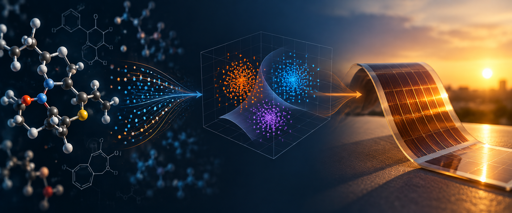

# Overview {.unnumbered .overview-title}

:::::::: {.ml-home}

:::::: {.ml-hero}

::::: {.ml-hero-copy}

:::: {.ml-brand}

{alt="Breda University of Applied Sciences logo"}

::: {.ml-program}
**Applied Data Science & AI**  
Year 1 · Machine Learning
:::

::::

::: {.ml-hero-title}
Machine learning,
with a real client.
:::

::: {.ml-lead}
You are a data scientist working with the Omega Lab on next-generation solar cells. As energy demand rises, we need more efficient solar technologies. The molecules used in solar cells are key to their performance. Your job: build machine-learning models that predict molecular properties, screening thousands of molecules in seconds to shortlist the most promising candidates for lab testing.
:::

::: {.ml-actions}
[Explore the course](#course-journey){.ml-btn .ml-btn-primary}
[View the notebooks on GitHub](https://github.com/BredaUniversityADSAI/ml-book){.ml-btn .ml-btn-secondary}
:::

:::::

::::: {.ml-hero-image role="img" aria-label="Machine learning, molecular chemistry and flexible solar-cell research"}
:::::

::::::

:::::: {.ml-course-info-wrap}

::::: {.ml-course-info}

::: {.ml-course-info-item .lead}

Instructor

M. Alican Noyan

Machine Learning

:::

::: {.ml-course-info-item}

Program

Applied Data Science & AI

Year 1 · 2026/27

:::

::: {.ml-course-info-item}

Institution

Breda University of Applied Sciences

Breda, The Netherlands

:::

::: {.ml-course-info-item}

Project Client

Prof. Derya Baran · OMEGA Lab

KAUST · Organic photovoltaics

:::

:::::

::::::

:::::: {.ml-section}

:::: {.ml-section-head}

::: {.ml-eyebrow}
Why this course is different
:::

## We teach machine learning through a real client problem—not as a collection of isolated algorithms.

Many introductory ML courses stop at clean datasets and self-contained exercises. Here, students work as applied data scientists: understand the client problem, inspect and prepare imperfect data, build baselines, evaluate honestly, iterate, and communicate what the result means.

::::

::::: {.ml-difference}

::: {.ml-diff-card}

1

### Start with the client

The client problem comes first. Students build enough understanding of the scientific domain to make sensible modelling decisions.
:::

::: {.ml-diff-card}

2

### Work with molecular data

Students move from SMILES strings and molecular descriptors to analysis-ready features rather than receiving a perfectly prepared toy table.
:::

::: {.ml-diff-card}

3

### Iterate through CRISP-DM

The process is deliberately non-linear: findings in modelling send students back to data understanding, preparation and feature engineering.
:::

::: {.ml-diff-card}

4

### Compete, explain, improve

Performance matters, but so does explaining why a model works, where it fails, and what should happen next.
:::

:::::

::::::

:::::: {.ml-section .ml-client}

:::: {.ml-client-copy}

::: {.ml-eyebrow}
The client
:::

## Prof. Derya Baran & the OMEGA Lab at KAUST

The course is built around a real client problem from the **Organic/Hybrid Materials for Energy Applications (OMEGA) Lab**, led by Prof. Derya Baran at King Abdullah University of Science and Technology (KAUST). The lab conducts research into solution-processable materials and devices for energy applications, including organic and hybrid photovoltaics.

Students take the role of **applied data scientists**. They use established machine-learning methods to predict properties of candidate molecules that matter for organic photovoltaics—turning chemical structure into useful evidence for the client. The research domain is solar energy; the students' contribution is applied machine learning.

[Visit the OMEGA Lab](https://omegalab.kaust.edu.sa/){target="_blank"} · [Prof. Derya Baran at KAUST](https://www.kaust.edu.sa/en/study/faculty/derya-baran){target="_blank"}

::::

:::: {.ml-video}
<iframe src="https://www.youtube.com/embed/2dMROtxPB3M?start=116" title="OMEGA Research Lab" allow="accelerometer; autoplay; clipboard-write; encrypted-media; gyroscope; picture-in-picture; web-share" allowfullscreen></iframe>
::::

::::::

:::::: {.ml-section}

:::: {.ml-section-head}

::: {.ml-eyebrow}
The modelling challenge
:::

## Three ML tasks, one real client problem.

Rather than learning classification, regression and clustering as unrelated chapters, students apply each method to a different part of the same client challenge.

::::

::: {.ml-pipeline}

:::

::::: {.ml-model-grid}

::: {.ml-model-card}

Classification

### Predict molecular stability

Build models that classify candidate molecules into stability categories and improve them through feature engineering, validation and tuning.
:::

::: {.ml-model-card}

Regression

### Predict HOMO & LUMO

Estimate molecular energy levels from chemical structure and evaluate models with appropriate regression metrics.
:::

::: {.ml-model-card}

Clustering

### Discover molecular similarity

Use unsupervised learning to identify molecular groups, investigate similarity, and feed those insights back into predictive modelling.
:::

:::::

::::::

:::::: {.ml-section}

:::: {.ml-section-head}

::: {.ml-eyebrow}
From guided to independent
:::

## The scaffolding disappears as students become more capable.

The course starts with strongly guided notebooks, then transitions to structured tasks, and finally to open-ended iteration where students decide what to try next.

::::

::::: {.ml-progress}

::: {.ml-step}
**01 · Guided**

### Build the first models

Step-by-step notebooks introduce the complete workflow and get classification, regression and clustering running quickly.
:::

::: {.ml-step}
**02 · Structured**

### Go deeper

Students investigate the data, prepare features, compare models and justify modelling choices with progressively less support.
:::

::: {.ml-step}
**03 · Open-ended**

### Iterate like a data scientist

Students choose experiments, tune models, engineer features and revisit earlier CRISP-DM phases based on evidence.
:::

:::::

::::::

:::::: {.ml-section #course-journey}

:::: {.ml-section-head}

::: {.ml-eyebrow}
Course journey
:::

## From machine-learning fundamentals to real-world application.

The self-study notebooks provide the conceptual spine. DataLab tasks turn those concepts into decisions on the client project.

::::

::::: {.ml-journey}

::: {.ml-journey-item}

Stage 1

### Foundations & end-to-end ML

What ML is, how a complete workflow fits together, and how to create first baseline models.
:::

::: {.ml-journey-item}

Stage 2

### Understand & prepare data

Explore distributions, relationships and quality issues; transform molecular information into useful features.
:::

::: {.ml-journey-item}

Stage 3

### Model & evaluate

Select metrics, build robust validation, compare baselines and understand the consequences of modelling choices.
:::

::: {.ml-journey-item}

Stage 4

### Supervised & unsupervised learning

Classification, regression, clustering, advanced scikit-learn workflows and tree-based methods.
:::

::: {.ml-journey-item}

Stage 5

### Advanced applied ML

Feature engineering, model selection, tuning, experimentation and evidence-driven iteration on a difficult real client challenge.
:::

:::::

::::::

:::::: {.ml-section}

:::: {.ml-section-head}

::: {.ml-eyebrow}
Two connected learning tracks
:::

## Learn the concepts. Then use them.

::::

::::: {.ml-tracks}

::: {.ml-track}
### 📘 Self-study notebooks

Concise explanations, executable examples and exercises covering the core machine-learning toolkit.

- Foundations of machine learning
- End-to-end ML workflows
- Data understanding & preparation
- Modelling & evaluation
- Supervised & unsupervised learning
- Advanced scikit-learn & tree-based methods
- Advanced applied ML
:::

::: {.ml-track}
### 🧪 DataLab tasks

Project work in which the same concepts are applied to molecular data for a real client problem in organic photovoltaics.

- CRISP-DM iteration and baseline models
- Business & data understanding
- Data preparation and molecular descriptors
- Classification of stability
- Regression of HOMO/LUMO levels
- Clustering and molecular similarity
- Model improvement through iterative experimentation
:::

:::::

::: {.ml-note}
**About the data:** the course uses real molecular structures and research-derived datasets. For a fair educational competition, course-specific target values are generated to follow realistic chemical distributions rather than reproducing all publicly available target values directly.
:::

::::::

:::::: {.ml-footer-cta}

:::: {.ml-footer-copy}
## Applied Data Science & AI at BUas

A public look at how we teach students to apply machine-learning fundamentals to real, difficult problems from the first year of the programme.
::::

::: {.ml-footer-action}
[Visit ADS&AI](https://ai.buas.nl/){.ml-btn .ml-btn-primary target="_blank"}
:::

::::::

::::::::
